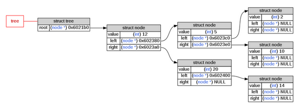

# C-Tycat: debugging graph for C

**C-Tycat** is a module that allows you to visually debug your program. From a
variable it creates a graph showing the current data tree.

This project is named **C-Tycat** because it use the `tycat` command from
[terminology][terminology] to display generated images directly in your terminal.
Please note that it is still possible to save this image instead of displaying it
in the terminal.

There are two ways to use **C-Tycat**: directly in C through a library or
as a GDB extension.

## `c-lib`: C-Tycat C library

The **C** library of **C-Tycat**. This library can be used either statically
(with `libctys.a`) or dynamically (with `libctyd.so`).

This library requires `libdw-dev` and `grahviz` to be installed in your Linux
distribution.

## `gdb-c`: GDB C extension

A GDB extension for tycat'ing variables in the GDB context. This extension uses
the **C** library of **C-Tycat** either static or dynamic.

This following commands are added to GDB:

- `ty <varname>`: tycat a variable
- `ty-config <key> [<value>]`: get or set a configuration option

## `gdb-py`: GDB Python extension

Another GDB extension that this time does not use the **C** library. This
extension is entirely written in Python and uses the GDB script API.

This extension is a bit slower than `gdb-c` extension but uses less memory
(because the debug symbols are only loaded once).

**This extension is under development, please gdb-c extension for the moment**.

## License

This project is under the MIT License.  
For more information read the file named `LICENSE` at the root of this project.

[terminology]: https://github.com/billiob/terminology
